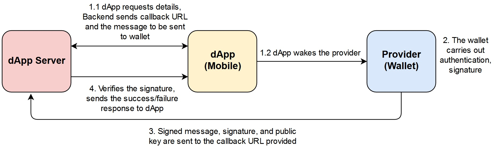
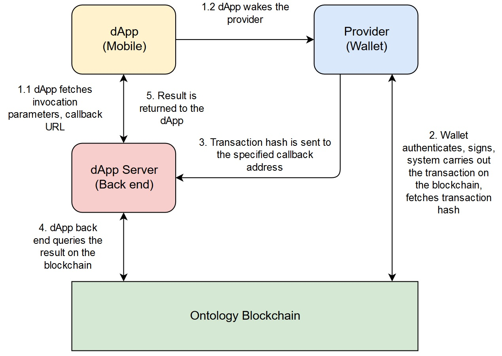

# Wake call mechanism

Certain wallet applications that implement special adaptation layers support being called from within other applications on the phone.

In this section, we talk about how to wake the wallet from inside an application and implement features such as login and smart contract invocation \(including payment method\). For more details on the application wake mechanism, please refer to [Android application demo](https://github.com/ontio-cyano/android-app-demo).

## Interaction Process

### Login flow


### Transaction flow


## dAPI protocol usage

With respect to the wake call, the development process involves implementing two functions - **login** and **smart contract invocation.**

The login process is simpler at it's core, so we won't go into any unnecessary details. The process is illustrated in the following section.

Smart contract invocation has a much broader scope of application. `dApps` can use smart contracts to implement various different kinds of logic. For example, in the case of a game, there are different operations and services that can be carried out using smart contracts, such as buying, selling, renting, etc.

### 1. Login

The core sequence of the login operation is illustrated in the picture below:



1. The `dApp` communicates with the back end to fetch the callback URL and a message to be sent to the dedicated `provider`, along with other information \(depending upon the implementation logic\), and wakes the wallet.
2. The `provider` wallet carries out user authentication and signs the message. 
3. The signed message is then returned to the `dApp` back end using the designated callback URL, along with the signed message, the signature and a public key for verification purposes.
4. The back end finally verifies the signature and sends a success/failure response to the `dApp`.

#### Login Data

When the `dApp` needs to login, it fetches the relevant login data in order to send it to the `provider` wallet.

An example of the data structure:

```yaml
{
    "action": "login",
    "id": "10ba038e-48da-487b-96e8-8d3b99b6d18a",
    "version": "v1.0.0",
    "params": {
        "type": "ontid or account",
        "dappName": "dapp Name",
        "dappIcon": "dapp Icon",
        "message": "helloworld",
        "expire": 1546415363,
        "callback": "http://127.0.0.1:80/login/callback"
    }
}
```

#### Specific usage procedure

1. Establish whether or not `Cyano Wallet` is installed on the system. An example verification method is provided below.

```java
public static boolean checkInstallCynoApp(Context context) {
       final PackageManager packageManager = context.getPackageManager();// Fetch the package manager
       List<PackageInfo> pinfo = packageManager.getInstalledPackages(0);// Get a list of all the installed packaged on the system
       if (pinfo != null) {
           for (int i = 0; i < pinfo.size(); i++) {
               String pn = pinfo.get(i).packageName.toLowerCase(Locale.ENGLISH);
               if (pn.equals("com.github.ont.cyanowallet")) {
                   return true;
               }
           }
       }
       return false;
   }
```

2. `dApp` sends the data it received from the `dApp` server to the dedicated provider \(wallet\). This can be realized in the following manner:

```java
   String data = "{\"action\":\"login\",\"id\":\"10ba038e-48da-487b-96e8-8d3b99b6d18a\",\"version\":\"v1.0.0\",\"params\":{\"type\":\"ontid or account\",\"dappName\":\"dapp Name\",\"dappIcon\":\"dapp Icon\",\"message\":\"helloworld\",\"expire\":1546415363,\"callback\":\"http://127.0.0.1:80/login/callback\"}}"; //此处就是将之前的登录数据拼接后的状态。

   String sendData = Base64.encodeToString(Uri.encode(data).getBytes(), Base64.NO_WRAP);
   Intent intent = new Intent("android.intent.action.VIEW");
   intent.setData(Uri.parse("ontprovider://ont.io?param=" + sendData ));
   intent.addCategory("android.intent.category.DEFAULT");
   startActivity(intent);
```

3. The `provider` verifies the submitted information and signs it, and transmits it back to the specified callback address. The developer need not execute this step manually.

4. The `dApp` back end verifies the signature to establish whether the login succeeded or failed and notifies the `dApp`.

### 2. Smart Contract Invocation

The core contract invocation process is illustrated in the figure below:



1. `dApp` side creates a contract invocation data set and sends it to the dedicated `provider`.
2. The `provider` carries out user authentication, signature process, and carries out the transaction by communicating with the blockchain.
3. The `provider` receives the transaction hash from the blockchain and transmits it to the `dApp` back end using the specified callback address.
4. The `dApp` server end queries the blockchain for the execution result using the transaction `hash`.
5. The final result is returned to the `dApp`, made accessible to the user.

#### Smart Contract invocation data

A sample contract invocation data set:

```yaml
{
    "action": "invoke",
    "version": "v1.0.0",
    "id": "10ba038e-48da-487b-96e8-8d3b99b6d18a",
    "params": {
        "login": true,
        "message": "will pay 1 ONT in this transaction",
        "callback": "http://101.132.193.149:4027/invoke/callback",
        "invokeConfig": {
            "contractHash": "16edbe366d1337eb510c2ff61099424c94aeef02",  //contract address
            "functions": [{
                "operation": "method name", //name of the method in the invoked smart contract
                "args": [{   //contract invocation arguments
                    "name": "arg0-list",//argument index 1's value is an array
                    "value": [true, 100, "Long:100000000000", "Address:AUr5QUfeBADq6BMY6Tp5yuMsUNGpsD7nLZ", "ByteArray:aabb", "String:hello", [true, 100], {
                        "key": 6
                    }]
                }, {
                    "name": "arg1-map",//argument index 2's value is a map
                    "value": {
                        "key": "String:hello",
                        "key1": "ByteArray:aabb",
                        "key2": "Long:100000000000",
                        "key3": true,
                        "key4": 100,
                        "key5": [100],
                        "key6": {
                            "key": 6
                        }
                    }
                },{
                       "name": "arg2-ByteArray", //argument index 3's value is a ByteArray
                       "value": "ByteArray:aabbcc"
                },{
                    "name": "arg3-int", //arguement index 4's value is int/long
                    "value": 100
                },{
                    "name": "arg4-str", //argument index 5's value is string
                    "value": "String:test"
                }]
            }],
            "payer": "AUr5QUfeBADq6BMY6Tp5yuMsUNGpsD7nLZ",
            "gasLimit": 20000,
            "gasPrice": 500
        }
    }
}
```


A Base58 address, for e.g., _AUr5QUfeBADq6BMY6Tp5yuMsUNGpsD7nLZ_  can be used to fill the `%address` parameter. The wallet converts the `%address` to the wallet's asset address. If the argument contains the `%ontid`, the wallet converts it to the wallet's `ontid` address.


#### Implementation Sequence

1. Ensuring the `Provider-sdk` wallet application is installed and deployed on the phone.
2. Composing the contract invocation `JSON` data set, making the wake call to the wallet.

Sample code:

```java
String data="{\"action\":\"invoke\",\"version\":\"v1.0.0\",\"id\":\"10ba038e-48da-487b-96e8-8d3b99b6d18a\",\"params\":{\"login\":true,\"qrcodeUrl\":\"http://101.132.193.149:4027/qrcode/AUr5QUfeBADq6BMY6Tp5yuMsUNGpsD7nLZ\",\"message\":\"will pay 1 ONT in this transaction\",\"callback\":\"http://101.132.193.149:4027/invoke/callback\"}}";


String sendData = Base64.encodeToString(Uri.encode(data).getBytes(), Base64.NO_WRAP);
Intent intent = new Intent("android.intent.action.VIEW");
intent.setData(Uri.parse("ontprovider://ont.io?param=" + sendData ));
intent.addCategory("android.intent.category.DEFAULT");
startActivity(intent);
```

3. The `provider` authenticates, signs, pre-executes, and finally transmits the transaction to the chain. \(This step does not require manual implementation\)

4. The `provider` sends the transaction hash retrieved from the blockchain to the `dApp` back end. \(This step is carried out depending on the `dApp's` event sequence\)

5. `dApp` queries the result from the blockchain.


Query methods reference:

* [Java SDK transaction event query methods](https://github.com/ontio/ontology-java-sdk/blob/master/docs/cn/basic.md#%E4%B8%8E%E9%93%BE%E4%BA%A4%E4%BA%92%E6%8E%A5%E5%8F%A3)
* [TypeScript transaction event query methods](https://github.com/ontio/ontology-ts-sdk/blob/master/test/websocket.test.ts) 


6. The `dApp` back end returns the result to the `dApp`, from where the user can access it. \(Depends on the logic of the `dApp`\)

#### dApp Server Callback Interface

The `provider` initiates transactions, carries out user authentication and signature, pre-executes the contract, and finally passes the transaction has to the callback URL via POST method.

_If the transaction succeeds, the wallet returns the following to callback:_

```yaml
{
  "action": "invoke",
  "id": "10ba038e-48da-487b-96e8-8d3b99b6d18a",
  "error": 0,
  "desc": "SUCCESS",
  "result": "tx hash"
}
```

_If the transaction fails, the wallet returns:_

```yaml
{
  "action": "invoke",
  "id": "10ba038e-48da-487b-96e8-8d3b99b6d18a",
  "error": 80001,
  "desc": "SEND TX ERROR",
  "result": 1
}
```

## Demonstration

The two example applications demonstrate the wake call for specially designated wallets. The code can be used for reference.

* [Wake wallet - Demo application](https://github.com/ontio-cyano/android-app-demo)
* [Unity game demonstration](https://dev-docs.ont.io/#/docs-cn/dApp-Integration/12-unity_integration)

## Code base for Reference

| **Signature verification methods** | **Transaction event query methods** | **Cyano Wallet** | **dAPI - Mobile provider SDK** | **dAPI - Mobile client SDK** |
| :---: | :---: | :---: | :---: | :--- |
| [Java SDK](https://github.com/ontio/ontology-java-sdk/blob/master/docs/cn/interface.md#%E7%AD%BE%E5%90%8D%E9%AA%8C%E7%AD%BE) | [Java SDK](https://github.com/ontio/ontology-java-sdk/blob/master/docs/cn/basic.md#%E4%B8%8E%E9%93%BE%E4%BA%A4%E4%BA%92%E6%8E%A5%E5%8F%A3) | [Cyano - Android](https://github.com/ontio-cyano/cyano-android) | [Cyano - Android SDK](https://github.com/ontio-cyano/cyano-android-sdk) | [Cyano bridge](https://github.com/ontio-cyano/cyano-bridge) |
| [TypeScript SDK](https://github.com/ontio/ontology-ts-sdk/blob/master/test/ecdsa.crypto.test.ts) | [TypeScript SDK](https://github.com/ontio/ontology-ts-sdk/blob/master/test/websocket.test.ts) | [Cyano - iOS](https://github.com/ontio-cyano/cyano-ios) | [Cyano - iOS SDK](https://github.com/ontio-cyano/cyano-ios-sdk) |  |

