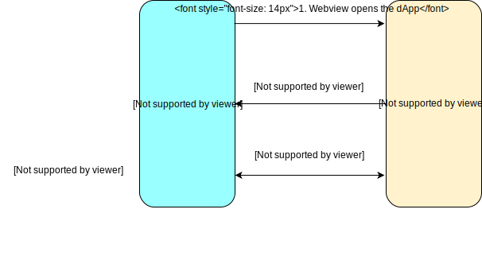

# Mobile wallet dApp

Considering the current scenario, mobile wallets apps are an important port of entry into `dApps`. After integrating Ontology's `cyano-bridge` package, the developer can implement and invoke `dAPI` that adheres to CEP-1 standards, and can communicate with any wallet `dApp` that integrates the `Provider SDK` to carry out chain-related operations.


Details regarding the OEP-1 protocol can be found [here](https://github.com/ontio-cyano/CEPs/blob/master/CEPS/CEP1.mediawiki).


## Interaction Process

Generally speaking, application users' primary concerns are the login and transaction procedure.

The process flow is illustrated in the following figure:




### Login scenario

1. A `dApp` is opened in the wallet's `dApp` store.
2. Two possible circumstances - either the `dApp` sends can account query request to th wallet and the wallet returns the asset account's address, or the `dApp` sends a login request to the wallet and the wallet returns signature data.
3. If the `dApp` verification is completed, access is granted.

### Smart Contract invocation scenario

1. The `dApp` sends an invocation request to the wallet.
2. The wallet digitally signs the transaction, pre-executes it, sends it to the chain, and returns the transaction `hash` to the `dApp`.

## dAPI protocol usage

### 1. Installation

Based on subjective requirements, one of the following two methods can be chosen to install `cyanobridge`.

**npm installation-**

```bash
npm install cyanobridge
```

**CDN installation-**

Currently, the latest version can be acquired using `jsDelivr`. Paste the following script on the page's code to instantly start using the `dAPI`.

```markup
<script src="https://cdn.jsdelivr.net/npm/cyanobridge/lib/browser.min.js"></script>
```


CDN users are advised to fix the version in the above link so as to avoid compatibility issues during updates.


### 2. Import

#### **CommonJS**

```javascript
var client = require('cyanobridge').client
```

#### **ES6 module**

```javascript
import { client } from 'cyanobridge'
```

#### **Web require**

To import the browser.js file inside the ./lib directory:

```markup
<script src="./lib/browser.js"></script>

var client = CyanoMobile.client;
```

### 3. Initialization

The `dAPI` needs to be initialized and registered before being used.

```javascript
import { client } from 'cyanobridge'
client.registerClient();
```

### 4. Method Usage

#### **Fetch account or user identity information**

`dApp` information is optional. The developer may choose not to fill it when making the function call.

```javascript
import { client } from 'cyanobridge'

const params = {
​    dappName: 'My dapp',
​    dappIcon: '' // some url points to the dapp icon
}

try {
​    const res = await client.api.asset.getAccount(params);
    const res = await client.api.identity.getIdentity(params);
​    console.log(res)
} catch(err) {
​    console.log(err)
}

```

#### **Login**

Login is signed on the wallet's end. The `dApp` carries out the verification signature.

```javascript
const params = {
    type: 'account',// account or identity that will sign the message
    dappName: 'My dapp', // dapp's name
    dappIcon: 'http://mydapp.com/icon.png', // the URL that points to the dapp's icon resource
    message: 'test message', // message sent from dapp that will be signed by native client
    expired: new Date('2019-01-01').getTime(), // expiry date of login
    callback: '' // callback url of dapp
}
let res;
try {
    res = await client.api.message.login(params);
    console.log(res)
}catch(err) {
    console.log(err)
}
```

#### **Invoke contract or initiate payment**

In case of queries regarding payment confirmation, please refer to: **//add FAQ link//** How to integrate ONG payment mechanism?

```javascript
const scriptHash = '8b344a43204e60750e7ccc8c1b708a67f88f2c43';
const operation = 'transferOng'
const args = [
   {
        "name": "arg0-id",
        "value": "String:hedgsg"
    }, {
        "name": "arg1-from",
        "value": "Address:AecaeSEBkt5GcBCxwz1F41TvdjX3dnKBkJ"
    }, {
        "name": "arg2-to",
        "value": "Address:AUr5QUfeBADq6BMY6Tp5yuMsUNGpsD7nLZ"
    }, {
        "name": "arg3-int",
        "value": 1
    }
]
const gasPrice = 500;
const gasLimit = 20000;
const payer = 'AecaeSEBkt5GcBCxwz1F41TvdjX3dnKBkJ'
const config = {
​    "login": true,
​    "message": "invoke smart contract test"
}
const params = {
          scriptHash,
          operation,
          args,
          gasPrice,
          gasLimit,
          payer,
          config
        }
try {
   const res = await client.api.smartContract.invoke(params);
   } catch(err) {
​    console.log(err)
}

```

#### Error codes

This is the list of error codes that the system returns.

| Error Code | Description |
| :---: | :---: |
| 0 | Success |
| 80001 | Params error |
| 80002 | Method error |
| 80003 | Internal error |

An example of the code returned \(JSON\):

```yaml
{
    "action": "login",
    "error": 0,
    "desc": "SUCCESS",
    "result": true
}
```

## Code base for Reference

| **Signature verification methods** | **Transaction event query methods** | **Cyano Wallet** | **dAPI - Mobile provider SDK** | **dAPI - Mobile client SDK** |
| :---: | :---: | :---: | :---: | :--- |
| [Java SDK](https://github.com/ontio/ontology-java-sdk/blob/master/docs/cn/interface.md#%E7%AD%BE%E5%90%8D%E9%AA%8C%E7%AD%BE) | [Java SDK](https://github.com/ontio/ontology-java-sdk/blob/master/docs/cn/basic.md#%E4%B8%8E%E9%93%BE%E4%BA%A4%E4%BA%92%E6%8E%A5%E5%8F%A3) | [Cyano - Android](https://github.com/ontio-cyano/cyano-android) | [Cyano - Android SDK](https://github.com/ontio-cyano/cyano-android-sdk) | [Cyano bridge](https://github.com/ontio-cyano/cyano-bridge) |
| [TypeScript SDK](https://github.com/ontio/ontology-ts-sdk/blob/master/test/ecdsa.crypto.test.ts) | [TypeScript SDK](https://github.com/ontio/ontology-ts-sdk/blob/master/test/websocket.test.ts) | [Cyano - iOS](https://github.com/ontio-cyano/cyano-ios) | [Cyano - iOS SDK](https://github.com/ontio-cyano/cyano-ios-sdk) |  |


