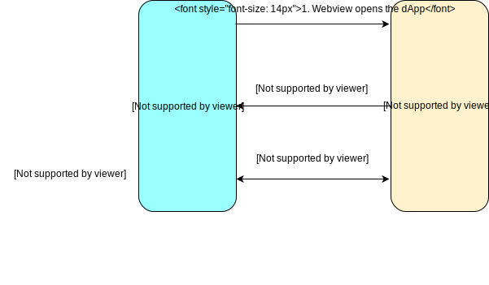

# Mobile wallet dApp

Considering the current scenario, mobile wallets apps are an important port of entry into `dApps`. After integrating Ontology's `cyano-bridge` package, the developer can implement and invoke `dAPI` that adheres to CEP-1 standards, and can communicate with any wallet `dApp` that integrates the `Provider SDK` to carry out chain-related operations.


Details regarding the OEP-1 protocol can be found [here](https://github.com/ontio-cyano/CEPs/blob/master/CEPS/CEP1.mediawiki).


## Interaction Process

