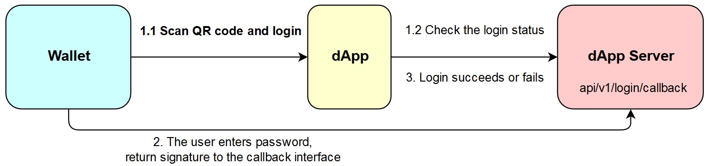
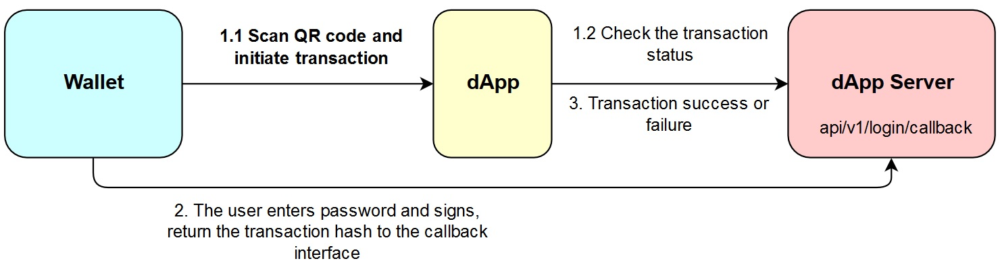

# QR code mechanism

This section aims at assisting the developer with integrating the QR code protocol `dAPI` into a dApp. This would allow the user to carry out services like login, invoke smart contracts, and more by scanning QR codes.

The parties involved in the process are:

* The `dApp` : Providing `dApps` for the users who are a part of the Ontology ecosystem is an important priority at Ontology.
* The `Provider`: Implementing `dAPI mobile` standard wallets.

## Fundamental concepts

Let us take a look at the processes that distributed technologies such as `dApps` and mobile wallets carry out.

### Role of dApps

The `dApp` back end primarily carries out the following tasks:

* `dApp` operations, i.e., generating the relevant login parameters, or the parameters for invoking smart contracts.
* Synchronizing with the on-chain data, and fetching the results of login, or smart contract invocation.

### Role of mobile wallets

A mobile wallet acts as a `provider`. It carries out the roles that involve interacting with the chain, such as providing the signature data, pre-executing and executing transactions, etc.


The above description is with respect to the wallets that can serve as providers. Currently, the following are supported:

* \*\*\*\*[**ONTO**](https://onto.app/) ****
* \*\*\*\*[**Cyano Wallet**](http://101.132.193.149/files/app-debug.apk)\*\*\*\*
* \*\*\*\*[**O-Wallet**](https://github.com/ontio/OWallet/releases)\*\*\*\*
* \*\*\*\*[**Math Wallet**](http://www.mathwallet.org/en/)\*\*\*\*
* \*\*\*\*[**Banko**](http://bankowallet.com/pc.html)\*\*\*\*
* \*\*\*\*[**Huobi Wallet**](https://www.huobiwallet.com/)\*\*\*\*


## Interaction Process

The following charts illustrate the login and smart contract invocation process.

**Login**



1. `dApp` submits the QR code
2. The `dApp` server executes the login method
3. The `dApp` back end verifies the signature

**Smart Contract Invocation**



1. `dApp` submits the QR code
2. `Provider` initiates the transaction, the user authenticates and signs, the contract is pre-executed, the user confirms, the process is transmitted onto the chain, and at the end the transaction hash is returned to the `dApp` back end
3. `dApp` back end confirms whether the transaction event was a success or failure by querying the chain

## dAPI protocol usage

The dAPI protocol currently supports login and smart contract deployment actions.

### 1. Login

The standard for supported QR codes:

```yaml
{
    "action": "login",
    "version": "v1.0.0",
    "id": "10ba038e-48da-487b-96e8-8d3b99b6d18a",
    "params": {
        "type": "ontid or account",
        "dappName": "dapp Name",
        "dappIcon": "link",
        "message": "helloworld",
        "expire": 1546415363, // QR Code expire time
        "callback": "http://101.132.193.149:4027/blockchain/v1/common/test-onto-login"
    }
}
```

Specification for the above fields-

| Field | Data type | Description |
| :---: | :---: | :--- |
| action | string | Describes the function of the QR code, login is defined as `login`, and smart contract invocation is defined as `invoke` |
| id | string | A serial number \(optional\) |
| type | string | Login action using ONTID is defined as`ontid`, wallet address login is defined as `account` |
| dappName | string | Name of the `dApp` |
| dappIcon | string | `dApp` icon resource \(link\) |
| message | string | Randomly generated, used for identity verification  |
| expire | long | Unix timestamp \(optional\) |
| callback | string | The URL sent to the `dApp` back end after the user scans the QR code and completes authentication |

#### dApp server side login interface


This interface is invoked after the wallet is done handling callback procedure. The server address must be an external IP address


```yaml
method: post

{
    "action": "login",
    "version": "v1.0.0",
    "id": "10ba038e-48da-487b-96e8-8d3b99b6d18a",
    "params": {
        "type": "ontid or account",
        "user": "did:ont:AUEKhXNsoAT27HJwwqFGbpRy8QLHUMBMPz",
        "message": "helloworld",
        "publickey": "0205c8fff4b1d21f4b2ec3b48cf88004e38402933d7e914b2a0eda0de15e73ba61",
        "signature": "01abd7ea9d79c857cd838cabbbaad3efb44a6fc4f5a5ef52ea8461d6c055b8a7cf324d1a58962988709705cefe40df5b26e88af3ca387ec5036ec7f5e6640a1754"
    }
}
```

Specification for the above fields-

| Field | Data type | Description |
| :---: | :---: | :--- |
| action | string | Operation type |
| id | string | Serial number \(optional\) |
| params | string | Method arguments |
| type | string | Login action using ONTID is defined as `ontid`, wallet address login is defined as `account` |
| user | string | The user account that authenticates the transaction - `ontid` or `wallet` address |
| message | string | Randomly generated, used for identity verification  |
| publickey | string | Wallet account public key |
| signature | string | User's signature - private key |

_**Success response:**_

```yaml
{
  "action": "login",
  "id": "10ba038e-48da-487b-96e8-8d3b99b6d18a",
  "error": 0,
  "desc": "SUCCESS",
  "result": true
}
```

_**Failure response:**_

```yaml
{
  "action": "login",
  "id": "10ba038e-48da-487b-96e8-8d3b99b6d18a",
  "error": 80001,
  "desc": "PARAMS ERROR",
  "result": 1
}
```

### 2. Data Signature

This process is analogous to the login protocol in every aspect, with the difference being when the `dApp` requests data signature the `dApp` name and `icon` are not required.

The QR code data of the data signature request looks like:

```yaml
{
    "action": "signMessage",
    "version": "v1.0.0",
    "id": "10ba038e-48da-487b-96e8-8d3b99b6d18a",
    "params": {
        "type": "ontid or address",
        "message": "helloworld",
        "ishex": false
        "callback": "http://101.132.193.149:4027/blockchain/v1/common/test-onto-login"
    }
}
```

Multi-signature data model:

```yaml
{
    "action": "signMultiMessage",
    "version": "v1.0.0",
    "id": "10ba038e-48da-487b-96e8-8d3b99b6d18a",
    "params": {
        "type": "ontid or address",
        "message": ["aabbccdd"],
        "ishex": true
        "callback": "http://101.132.193.149:4027/blockchain/v1/common/test-onto-login"
    }
}
```

| Field | Type | Description |
| :---: | :---: | :--- |
| action | string | Operation type |
| type | string | Login action using ONTID is defined as`ontid`, wallet address login is defined as `address`, if left blank the field is set to `address` by default |
| message | string | Randomly generated, used for identity verification  |
| ishex | bool | Whether or not the message is a hex code |
| callback | string | The URL sent to the `dApp` back end after the user scans the QR code and completes authentication |

After the wallet's response is decoded by the **URI decoder** and the **Base64 decoder**, the resultant data follows the format illustrated below.

The success response returned to the callback address is of the form:

```yaml
method: post
{
    "action": "signMessage",
    "version": "v1.0.0",
    "id": "10ba038e-48da-487b-96e8-8d3b99b6d18a",
    "error": 0,
    "desc": "SUCCESS",
    "result": {
        "type": "ontid or address",
        "user": "did:ont:AUEKhXNsoAT27HJwwqFGbpRy8QLHUMBMPz or AUEKhXNsoAT27HJwwqFGbpRy8QLHUMBMPz",
        "message": "helloworld",
        "publickey": "0205c8fff4b1d21f4b2ec3b48cf88004e38402933d7e914b2a0eda0de15e73ba61",
        "signature": "01abd7ea9d79c857cd838cabbbaad3efb44a6fc4f5a5ef52ea8461d6c055b8a7cf324d1a58962988709705cefe40df5b26e88af3ca387ec5036ec7f5e6640a1754"
    }
}

If the action is signMultiMessage, the result is an array
```

### 3. Smart Contract Invocation

Transactions are also a feature of smart contracts. Here's the standard for smart contract invocation QR code:

```yaml
{
    "action": "invoke",
    "version": "v1.0.0",
    "id": "10ba038e-48da-487b-96e8-8d3b99b6d18a",
    "params": {
        "login": true,
        "callback": "http://101.132.193.149:4027/invoke/callback",
        "expire": 1546415363, // QR code expiry
        "qrcodeUrl": "http://101.132.193.149:4027/qrcode/AUr5QUfeBADq6BMY6Tp5yuMsUNGpsD7nLZ"
    }
}
```

| Field | Data type | Description |
| :--- | :--- | :--- |
| action | string | Operation type, login is defined as `login`, and smart contract invocation is defined as `invoke` |
| qrcodeUrl | string | QR code argument address |
| callback | string | Returns the transaction hash to the `dApp` server side \(optional\) |
| expire | long | Unix timestamp of QR code expiration \(optional\) |

The GET request content based on QR code's `qrcodeUrl` is as follows:

```yaml
{
    "action": "invoke",
    "version": "v1.0.0",
    "id": "10ba038e-48da-487b-96e8-8d3b99b6d18a",
    "params": {
        "invokeConfig": {
            "contractHash": "16edbe366d1337eb510c2ff61099424c94aeef02",  //contract address
            "functions": [{
                "operation": "method name", //name of the method in the invoked smart contract
                "args": [{   //contract invocation arguments
                    "name": "arg0-list",//argument index 1's value is an array
                    "value": [true, 100, "Long:100000000000", "Address:AUr5QUfeBADq6BMY6Tp5yuMsUNGpsD7nLZ", "ByteArray:aabb", "String:hello", [true, 100], {
                        "key": 6
                    }]
                }, {
                    "name": "arg1-map",//argument index 2's value is a map
                    "value": {
                        "key": "String:hello",
                        "key1": "ByteArray:aabb",
                        "key2": "Long:100000000000",
                        "key3": true,
                        "key4": 100,
                        "key5": [100],
                        "key6": {
                            "key": 6
                        }
                    }
                },{
                       "name": "arg2-ByteArray", //argument index 3's value is a ByteArray
                       "value": "ByteArray:aabbcc"
                },{
                    "name": "arg3-int", //arguement index 4's value is int/long
                    "value": 100
                },{
                    "name": "arg4-str", //argument index 5's value is string
                    "value": "String:test"
                }]
            }],
            "payer": "AUr5QUfeBADq6BMY6Tp5yuMsUNGpsD7nLZ",
            "gasLimit": 20000,
            "gasPrice": 500
        }
    }
}
```

