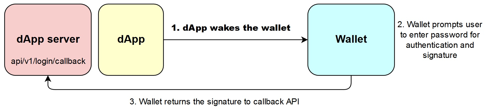
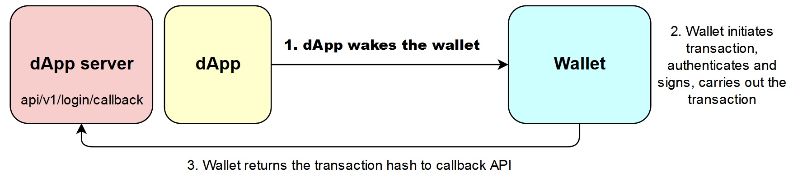

# Wake call mechanism

Certain wallet applications that implement special adaptation layers support being called from within other applications on the phone.

In this section, we talk about how to wake the wallet from inside an application and implement features such as login and smart contract invocation \(including payment method\). For more details on the application wake mechanism, please refer to [Android application demo](https://github.com/ontio-cyano/android-app-demo).

## Interaction Process

### Login flow

### Transaction flow

## dAPI protocol usage

With respect to the wake call, the development process involves implementing two functions - **login** and **smart contract invocation.**

The login process is simpler at it's core, so we won't go into any unnecessary details. The process is illustrated in the following section.

Smart contract invocation has a much broader scope of application. `dApps` can use smart contracts to implement various different kinds of logic. For example, in the case of a game, there are different operations and services that can be carried out using smart contracts, such as buying, selling, renting, etc.

### 1. Login

The core sequence of the login operation is illustrated in the picture below:

## Demonstration

The two example applications below wake specially designated wallets. The code can be used for reference.

* [Wake wallet - Demo application](https://github.com/ontio-cyano/android-app-demo)
* [Unity game demonstration](https://dev-docs.ont.io/#/docs-cn/dApp-Integration/12-unity_integration)

