# SmartX IDE Basics

This brief tutorial will help you with private chain smart contract set-up, testing, and finally deployment on the main net.

There are certain tools that will be key to the process that follows-

* **SmartX** **-** Ontology's online Smart contract IDE and debugger.
* **Solo-chain** **-** A prebuilt private chain.
* **Cyano wallet -** Ontology's Google Chrome plug-in.


SmartX can test run smart contracts and deploy them on the test net all by itself. Thus, it is not necessary to install and use solo-chain. You can apply for test tokens **here. /add link/**


## How to invoke a smart contract in SmartX

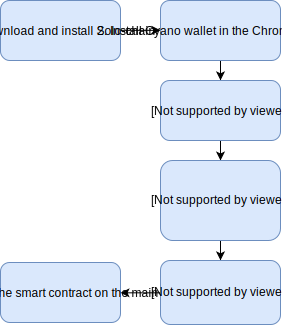

### 1. Download and install solo-chain

Solo-chain is a prebuilt private chain. It encapsulates many different network communication and monitoring tools.

Set up solo-chain and verify whether it operates as configured. You can do this by checking the blocks that are currently being generated and the transactions that are taking place.


Please note down the IP address that is displayed in the control panel for future reference.


### 2. Install Cyano Wallet plugin in Google Chrome

`Cyano` wallet is a chrome integrated development program which allows developers to deploy and test smart contracts on the test net and main net.

Install `Cyano` wallet and then in the main window click on the  icon in the top right corner.

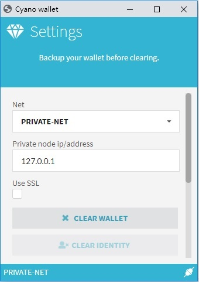

Change the "Net" option to **`PRIVATE-NET`**, and paste the IP address copied from solo-chain \(Under normal circumstances the address of the private node is `127.0.0.1`\). Save the settings by scrolling down and clicking the save button at the bottom.

Once `Cyano` successfully connects to the private net, the  icon at the bottom right corner of the wallet window will change to icon indicating that the connection has been successfully established.


For users with slower network speeds, the connection phase might take a few seconds.


Next, the private key is imported to the `Cyano` wallet from the `solo-chain`.

At the end, transactions can be initiated and the transaction fees can be drawn in `ONG`. The transaction fees here refer to the costs incurred during the testing and deployment phases of the smart contract respectively.

### 3. Accessing SmartX IDE

We will use `SmartX` to develop, compile, and test smart contracts. Useful information regarding Smart contract development can be found here. /add link/

> Here's the link to the IDE - [https://smartx.ont.io/](https://smartx.ont.io/)

You can login to `SmartX` using your `Cyano` wallet .dat file if you're already registered, or you can login  using Github.

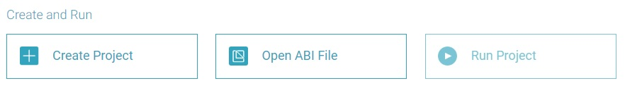

Once logged in, you can create a new project. After selecting the new project option, you will be prompted to select a programming language.

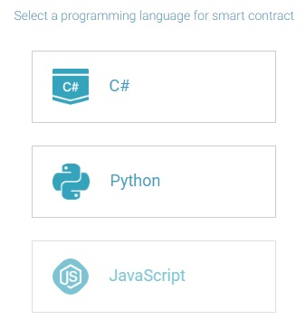

Select the programming language of your choice. Next, a list of templates will appear. Select the template that is the most appropriate, or you can choose to choose the "Blank" option in case you want to start with a blank file. Give your file a name and proceed.

For simplicity, here we demonstrate the "Domain" template written in Python.

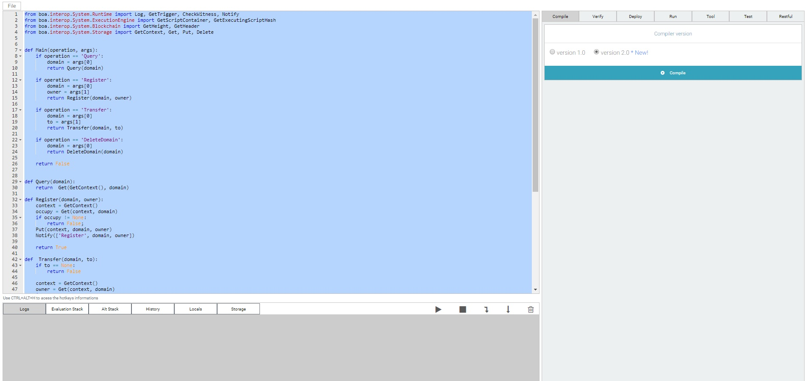

The next window that pops up is the main IDE that encapsulates editing, compilation, and testing of smart contracts into one convenient package.

### 4. Compiling and Deploying Smart contracts

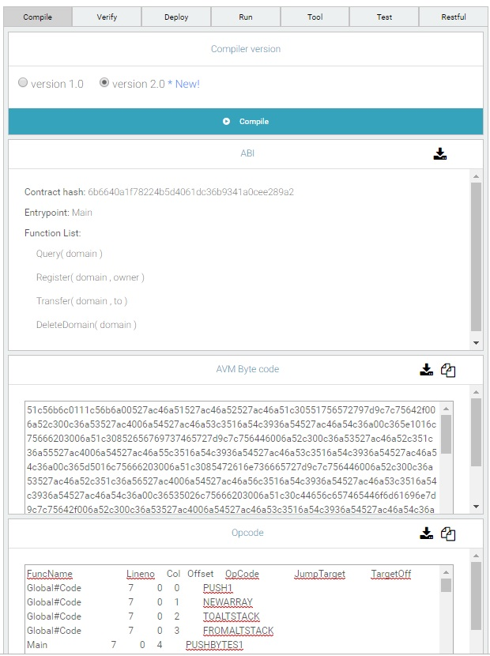

Once you complete the editing process of your code, it can be compiled using the compile function that is accessible from the right hand side pane under the compile section. If the code is successfully compiled, a lot of useful information such as the `AVM` bytecode and the `ABI` details will be displayed on the bottom.

Next, you may proceed to deploy the contract. 


Please note that deploying, running and testing contracts incurs gas cost and uses 0.01 units of `ONG`, and thus requires a certain amount of `ONG` balance to be present in your wallet. In case you don't have any, test tokens are available free of cost and can be applied for [here](https://developer.ont.io/applyOng).


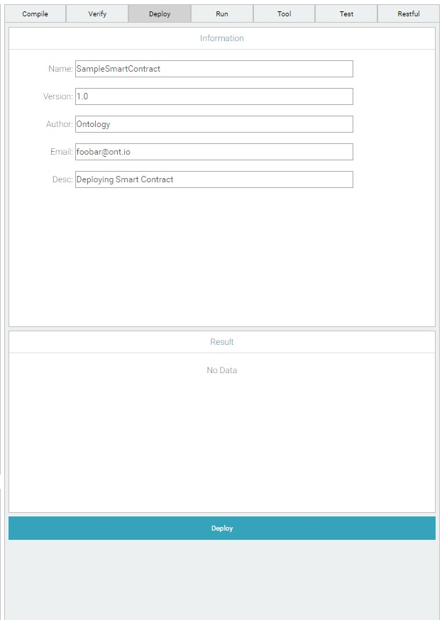

Fill in the details and deploy the contract.

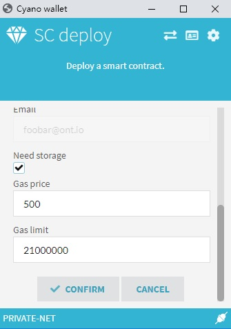

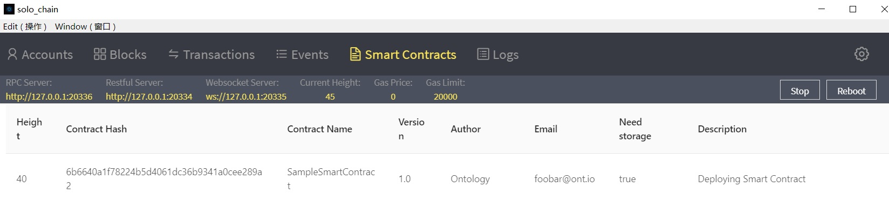

Using `solo-chain`, it can be confirmed whether or not the smart contract was successfully deployed. If the contract is deployed successfully you may then run it.

Under the run tab, the contract hash and a drop down list populated with the available functions can be accessed. The respective arguments in their corresponding data types can be passed through this pane.

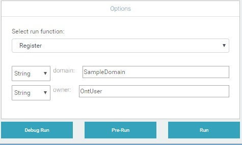

The three operations over here can be used to perform the following functions-

* _**Debug Run:**_  can be used to verify whether the code works as intended within the local environment. 
* _**Pre-Run:**_  can be used to invoke the query method, get the gas limit of the contract.
* _**Run:**_  the engine calls the smart contract and brings up the wallet, wherein the `gas price` can be set. Once confirmed,  the transaction is authorized and the transaction fee is charged in `ONG`.

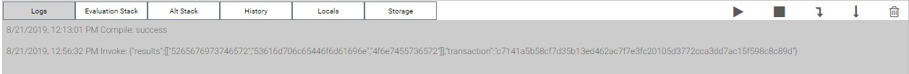

Every time the system returns a value or response, it will be displayed in the logs section. The return values are limited to hashes and hexademical values. There is a separate `tools` section in the top right hand pane which facilitates conversion between different units and data types, among other useful tools.

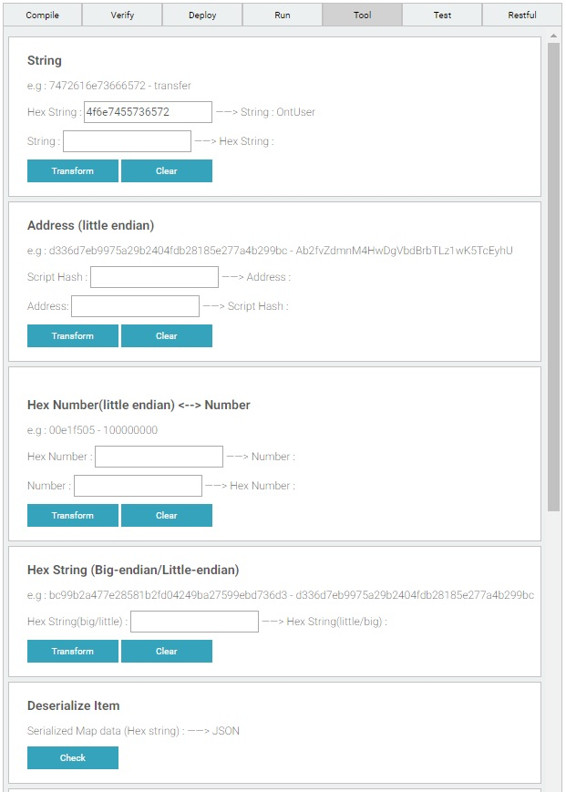

The `test` tab allows for multiple functions to be executed simultaneously. This allows for testing to mimic how the smart contract would actually function in real time when integrated into a `dApp`. 

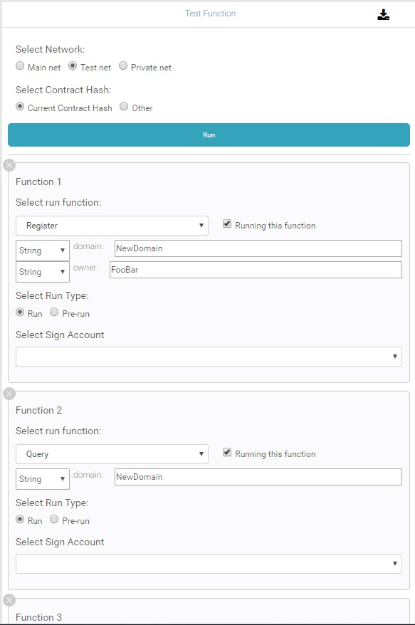

The "restful" tab refers to the `restful` API that Ontology employs as the link that allows for communication with nodes. Here we use it to fetch chain and transaction related information.

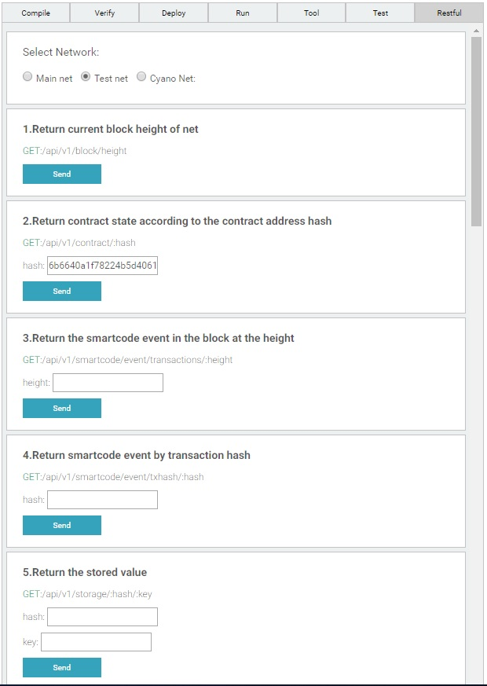

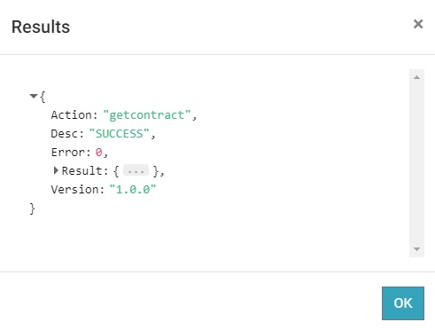

The collapsed `result` tab in the pop-up window includes detailed information with respect to the query. The tab can be expanded to reveal the information.

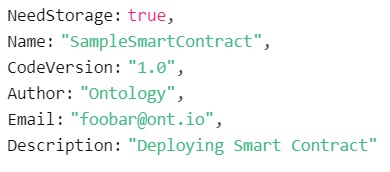

### 5. Migrating to Main net

Once the testing phase completes, we can move on to deploying the smart contract on the `MAIN-NET`.

First, bring up the `Cyano` wallet and access settings by clicking on the cog  in the top right hand corner.

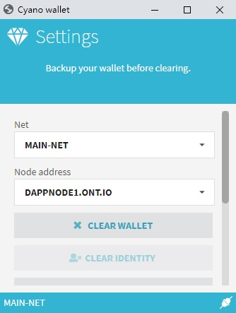

Save the settings and your wallet will connect to the `MAIN-NET`.


At this point, do ensure that your wallet has enough gas to further deploy contracts. 


Next, you may return to SmartX and continue with the development process. The procedure to test and deploy the contracts does not change. Before you proceed, do confirm that the wallet's connection to the `MAIN-NET` is still intact.

