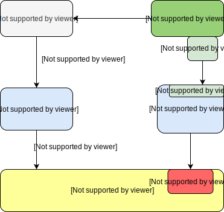

# Getting Started

With the `dApp` development process in mind, Ontology has made available a one stop solution in order to assist developers with the initial learning curve and help them get acquainted with `dApp` development. 

`dApp` development can be conveniently understood as a composition of 2 elements- Smart contract development, and `dAPI` integration.

* When the `dApp` needs to synchronize and update its data from the chain, it can do so using any of Ontology's`SDKs`, or invoking the `Restful interface` or `RPC interface`. Feel free to check out the details regarding the aforementioned components.


The dApp backend is not a necessary prerequisite. Certain dApps may not need a backend.


* The economic model of certain dApps requires tokens to implement key functionalities. If that is the case, the user may release tokens as and when needed. `OEP4`, OEP4 functionality in a smart contract, and smart contract sample code might be worth taking a look at.
* Some special purpose dApps might need to store data on the chain. Consider taking a look at the following link for reference.



Generally speaking, the fundamental logic for most dApps completes within the scope of smart contracts. The various tools made available from Ontology's side help speed up development and deployment, or in some cases, migrate contracts from other chains onto Ontology. Ontology also provides the standard interface to interact with smart contracts, the dAPIs, thereby allowing the users to conveniently use dApps without compromising on security. There is no risk of losing the private key. The `dApp` developers have the freedom to solely focus on developing the core logic of the `dApp`.

Let's go through the basics of how to set up a dApp.

But first, let us install the development tools that are core to the development process.

